# Configure Azure AD to use Single Sign-On (SSO) for MISP

This plugin enables authentication with an Azure Active Directory (now called [Entra-ID](https://www.microsoft.com/en-us/security/business/identity-access/microsoft-entra-id)) server. Under the hood it uses oAuth2. There are still a number of rough edges but in general the plugin works.

It supports verification if a user has the proper ‘MISP AD’ groups. Users should already exist in MISP. Future enhancement could include auto-create users

## Azure AD — App Registration Configuration

In Azure, add a new App Registration. Select Web and set the Redirect URI to your MISP server login page `https://misp.yourdomain.com/users/login`. The MISP instance does not need to be publicly accessible if it is reachable by your browser. The redirect URI that you specify here must be the same as used in the MISP configuration (including `/users/login`). You can add as many redirect URIs as needed, meaning you can have multiple MISP servers use the same Azure App.

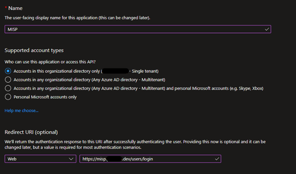

On the Overview page of the new MISP App Registration capture the following information.

- [x] Application (client) ID
- [x] Directory (tenant) ID

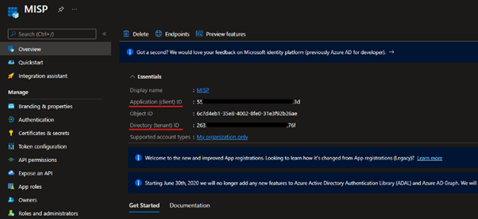

Under Manage in the MISP App Registration, select Certificates & secrets and then add a new client secret, set a valid date on the Secret of your choosing, in this example I have selected 3 months.

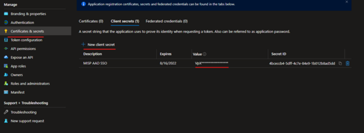

Make a note of the secret in the Value column before clicking off of this page.

- [x] Secret.Value

### Add group permissions (Optional)

If you want to limit access to users belonging to certain AD groups, then add the permissions to query the group data.

In the application details, select API permissions, Add a permission, click Microsoft Graph, Delegated permissions and add the permission `Group.Read.All`.

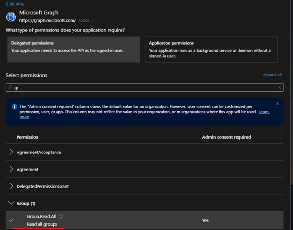

Once that’s done, in the API permissions screen, click the “Grant admin consent”.

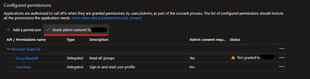

Create the following groups in Azure AD, these can be called anything you like following your standard naming convention. We will configure these later in the config.php.

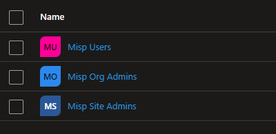

Make a name of your groups, we'll need these later.

- [x] Misp Users
- [x] Misp Org Admins
- [x] Misp Site Admins

## Enable the AAD Plugin for MISP

On your Ubuntu server switch user to misp.

```BASH
su misp
```

Enter the MISP user password that we recorded after MISP finished installing.

```TEXT
The LOCAL system credentials:
User: misp
Password: f37827f21bfea08f4f11bb749b132772523b665f7a151c05ca3e3f0d65b299a2 
```

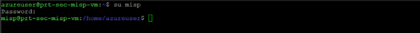

Next we need to edit the bootstrap.php file to add the AAD plugin.

```BASH
sudo nano /var/www/MISP/app/Config/bootstrap.php
```

Add the following under plugins

```PHP
CakePlugin::load('AadAuth');
```

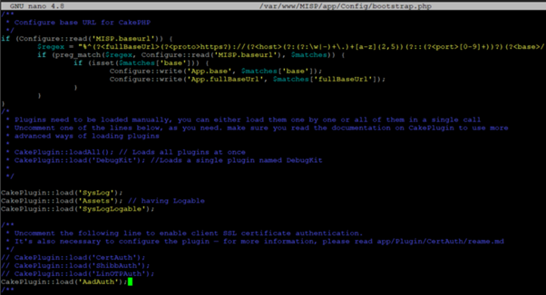

**Note:** This line does not exist in the bootstrap.php files and needs to be added.

**Warning: Before continuing with the next step make a backup of the original `config.php` file**

```BASH
sudo cp /var/www/MISP/app/Config/config.php /var/www/MISP/app/Config/config.orig.php
```

Now open the config.php file to make some changes.

```BASH
sudo nano /var/www/MISP/app/Config/config.php
```

Add the following configuration under security:

```PHP
'auth' =>
    array (
      0 => 'AadAuth.AadAuthenticate',
    ),
```

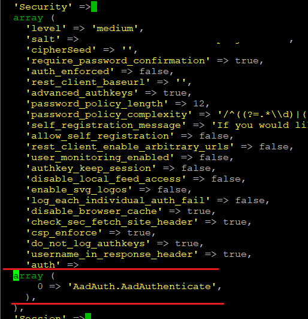

Scroll down to near the bottom of the page and add in the following configuration:

```PHP
'AadAuth' =>
  array (
    'client_id' => '', // Client ID (see Azure AD)
    'ad_tenant' => '', // Directory ID (see Azure AD)
    'client_secret' => '', // Client secret (see Azure AD)
    'redirect_uri' => 'https://misp.mydomain.com/users/login', // Your MISP URI, must be the same as in Azure AD
    'auth_provider' => 'https://login.microsoftonline.com/', // No change required
    'auth_provider_user' => 'https://graph.microsoft.com/', // No change required
    'misp_user' => 'Misp Users', // The AD group for MISP users
    'misp_orgadmin' => 'Misp Org Admins', // The AD group for MISP administrators
    'misp_siteadmin' => 'Misp Site Admins', // The AD group for MISP site administrators
    'check_ad_groups' => true, // Should we check if the user belongs to one of the above AD groups?
  ),
```

Add the information we made a note of earlier when creating the `App Registration` and optionally the Azure AD groups you created.

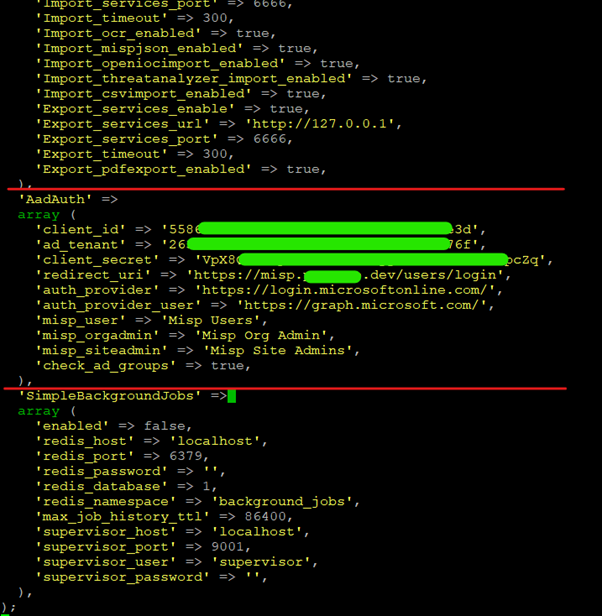

All fields need to match explicitly without any leading or trailing whitespace, if you added the groups these are case sensitive.

### Disable users password change
By default MISP will still create a password for the user, when enrolling a new user on MISP, uncheck the _"Send credentials automatically"_ checkbox.

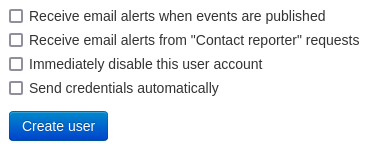

Additionally, it is recommended to set the following settings in the MISP config:

* `MISP.disableUserSelfManagement => true`: Removes the ability of users to change their user settings and reset their authentication keys.
* `MISP.disable_user_login_change => true`: Removes the ability of users to change their username (email), except for site admins.
* `MISP.disable_user_password_change => true`: Removes the ability of users to change their own password.

This way users will not be able to change their passwords and by-pass the AAD login flow.

# Create users via the MISP REST API

Because users already need to exist in MISP before they can authenticate with AAD it can be useful to provision them in an automated fashion. This can be done by creating the users via the MISP REST API. The below `curl` command provides an example on how to do this. Note that you need an API key.

```
curl -k -d '{"email":"newuser@mycompany.com", "role_id":"3", "org_id":"1", "enable_password":"1", "change_pw":"0"}' -H "Authorization: API_KEY"  -H "Accept: application/json" -H "Content-type: application/json" -X POST htps://misp.mycompany.com/admin/users/add
```
