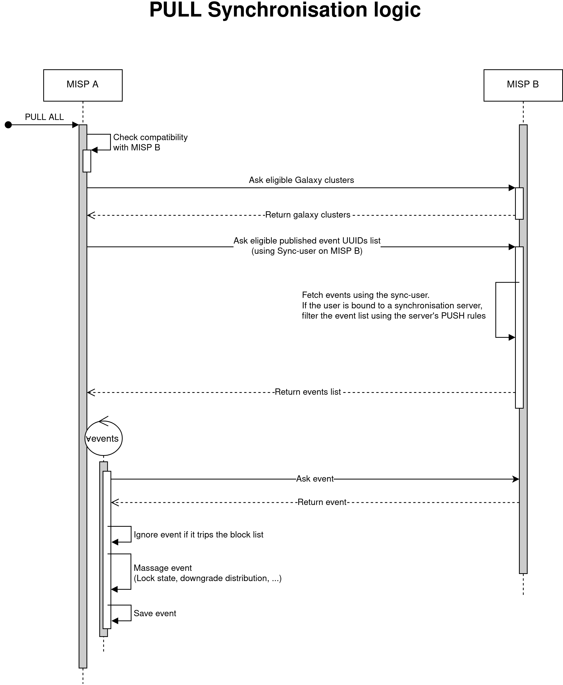

# Data visibility for Sync-users

Sync-users are used to serve as the point of connection between instances.
Typically, events pushed to an instance are created via a sync-user account residing on the remote instance.
Events pulled from an instance are fetched using the remote's sync user account and are then saved locally.

Special treatment may happen to sync-users if they are bound to a synchronisation server.
This binding can be set when editing a user.

## Standard server connection without filtering rules

### State
- User Role = `perm_sync`
- `MISP.unpublishedprivate` = false
    - True will deny access to unpublished events to users outside the organization of the submitter except site admins.


### Conditions
- `cond_org`: Does the event belong to the requesting user's org
- `cond_unpublished_private`: Should unpublished events be hidden for users outside the event's organisation
- `cond_distribution`: Does the event's distribution level allows it to be view by the requesting user

Where `cond_distribution` is as follow:
```
Event.distribution ∈ [1, 2, 3] ∨ (Event.distribution = 4 ∧ User ∈ Event.sharing_group_id)
```

Events are retrieved from the database if the following condition is met:
```
cond_org ∨ (cond_distribution ∧ cond_unpublished_private)
```


## Server connection with PUSH filtering rules

### State
- User Role = `perm_sync`
- `MISP.unpublishedprivate` = false // True will deny access to unpublished events to users outside the organization of the submitter except site admins.
- Server has PUSH rule(s)
    - e.g.: Events with the tag `exportable` are allowed


### Conditions
- `cond_org`: Does the event belong to the requesting user's org
- `cond_unpublished_private`: Should unpublished events be hidden for users outside the event's organisation
- `cond_distribution`: Does the event's distribution level allows it to be view by the requesting user
- `cond_push_rule`: Any events to be pushed must satisfy this condition

Where `cond_distribution` is as follow:
```
Event.distribution ∈ [1, 2, 3] ∨ (Event.distribution = 4 ∧ User ∈ Event.sharing_group_id)
```

Events are retrieved from the database if the following condition is met:
```
( cond_org ∨ (cond_distribution ∧ cond_unpublished_private) ) ∧ cond_push_rule
```

## Synchronisation logic



