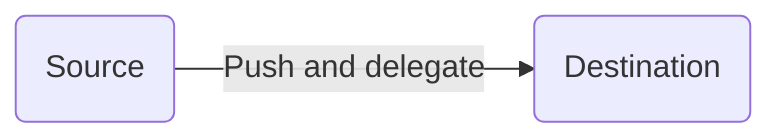

# MISP Delegation

## Overview

This script facilitates synchronization between two MISP instances using the PUSH strategy and supports delegation requests on the remote MISP. It provides flexible options for customization, including event filters, delegation request parameters, and incremental synchronization.

## Features

- **Push Strategy:** Utilizes the PUSH strategy for synchronization between a source and a destination MISP instance.
- **Delegation Request:** Requests delegation on the remote MISP after pushing events.
- **Event Filters:** Supports filters from the event/index endpoint on the source MISP instance.
- **Customization:**
  - Specify desired distribution level for delegation requests.
  - Customize delegation request messages.
- **Incremental Synchronization:**
  - Syncs events that were created or modified since the last execution.
- **Hooks:**
  - Attach or detach tags on the source MISP instance using hooks.


## Installation

### Prerequisites
- Python 3.x

## Installation
```bash
cd tools/misp-delegation/src
python3 -m venv venv
source venv/bin/activate 
pip3 install -rU requirements.txt
cp config.json.dist config.json
```

### Configuration

1. Open the `config.json` file.
2. Customize the following parameters:
   - `misp_instance.source`: URL and API key for the source MISP instance.
   - `misp_instance.destination`: URL and API key for the destination MISP instance.
   - `filters`: List of filters support by /event/index
   - Other customization options as needed.

### Help
```text
usage: misp-delegation.py [-h] [-c CONFIG]

optional arguments:
  -h, --help            show this help message and exit
  -c CONFIG, --config CONFIG
                        The JSON config file to use
```

## Usage

### Running the Script

```bash
python3 misp-delegation.py
```

## Examples

The following configuration file instructs the script to execute the following tasks:
1. Retrieve events for pushing to the destination MISP instance based on the defined filters
    - Specifically, events tagged with `to_delegate` will be fetched.
    - With `incremental_sync` enabled, only events modified or created since the last execution will be considered.
    - As `unpublish_event_on_remote` is enabled, the event pushed on the remote will be in an unpublished state, regardless of its state on the source instance.
2. Push the collected events to the destination MISP
3. Generate a delegation request on the destination MISP using the configuration specified in the `delegation` key.
4. For all successfully delegated events execute two tag actions on the source instance:
    - Attach the local tag `delegation:successful` on all delegated on events
    - Detach the `to_delegate` tag from all delegated on events



```json
{
    "misp_instance": {
        "source": {
            "url": "https://misp1.admin.test/",
            "api_key": "rQooTtK0IRtG7YlL5IPbXoVFzCKJPAHMBv3jMGHT",
            "verify_ssl": true
        },
        "destination": {
            "url": "https://misp2.admin.test/",
            "api_key": "IwikG4g8Cak1Vk5wTZpskcOp225IlnCw2mx9KhoA",
            "verify_ssl": true
        }
    },
    "filters": {
        "tags": [
            "to_delegate"
        ]
    },
    "delegation": {
        "target_org_uuid": "591c3fb6-4abe-4d47-b2ea-22e2299819e9",
        "desired_distribution": "3",
        "sharing_group_uuid": "d1492e7a-748f-4615-a1d6-893abdffa5db",
        "message": "We kindly request you to take over this event"
    },
    "incremental_sync": true,
    "unpublish_event_on_remote": true,
    "tag_actions": {
        "attach": [
            "delegation:successful"
        ],
        "detach": [
            "to_delegate"
        ]
    }
}
```
